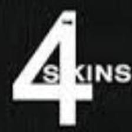
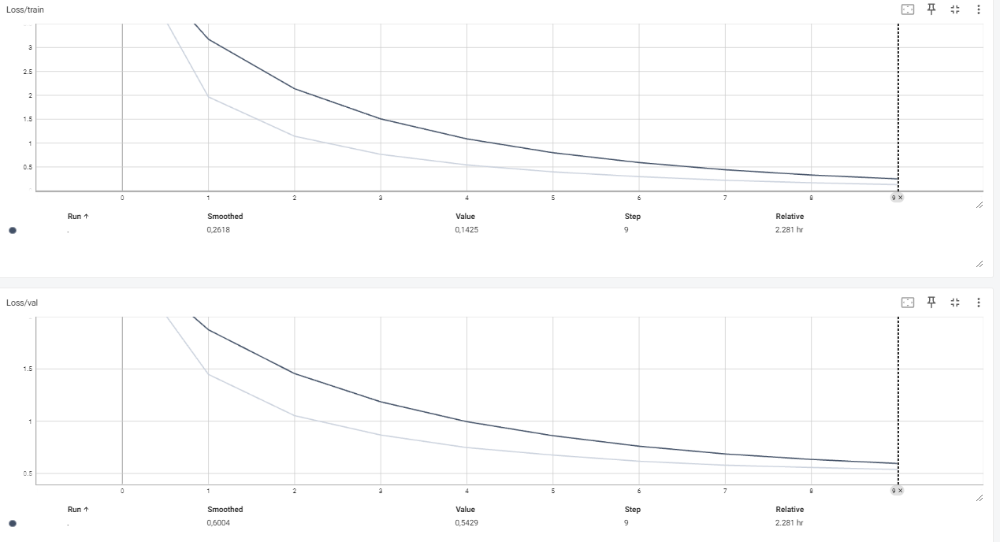

### Здесь приведено небольшое исследование и предложен способ решения следующей задачи:

*Предложите систему, которая позволит по кропу области с произвольным логотипом на изображении (берется из видео, куда нативно встроена реклама) отвечать на вопрос: "Является ли он логотипом искомой организации?".*

*В качестве логотипов искомой организации дается несколько образцов. Заранее неизвестно, что именно эта организация будет искаться. Логотипы могут быть текстовыми и нетекстовыми.*

*На изображении в реальности данные логотипы могут иметь самый различный масштаб, могут иметь отличные характеристики по яркости, контрастности, могут быть повернуты, несколько искажены, иметь небольшие отличия в дизайне.*  

---
  
**Здесь (в README) представлен обзор используемых методов и выбранных архитектур, подробности вместе с кодом в [research.ipynb](research.ipynb).**  
**Веса финальной модели находятся в [model_2_triplet_weights.pth](model_2_triplet_weights.pth).**

---

Для детального рассмотрения задачи использовался открытый датасет: https://paperswithcode.com/dataset/logodet-3k.  
  
Данный датасет содержит около 200 000 изображений логотипов 3000 компаний. К каждому изображению прилагается аннотация .xml, в
которой указана ветка логотипа и его расположение на фотографии (`bounding box`). 

Иерархия датасета выглядит следующим образом:
```text
LogoDet-3K
├── Medical
│   ├── yunnanbaiyao
│   │   ├── 1.xml
│   │   ├── 2.xml
│   │   ├── 5.xml
│   │   ├── ...
│   │   ├── 1.jpg
│   │   ├── 2.jpg
│   │   ├── 5.jpg
│   │   └── ...
│   ├── zendium
│   ├── uphamol
│   └── ...
├── Transportation
├── Clothes
├── Necessities
└── ...
```

Картинка с аннотацией из данного датасета выглядит вот так:  
<p align="center">
  
</p>

---
Синтезируемая система для распознавания логотипов предполагает предварительную детекцию. В данном исследовании для упрощения (и в соответствии
с условиями задачи) будем предполагать, что детекция уже произведена, и мы чётко выделили 
логотип на каждом изображении.  
  
В этом предположении нам не нужна представленная изначально структура и разметка, поэтому мы трансформируем датасет.  
Первым этапом мы вырежем логотип по внутренней части bounding box-а и приведём его к фиксированному размеру 224х224 пикселя.  
Далее мы сохраним полученные картинки в папки соответствующие названию бренда, чтобы получилось вот так:
```text
Processed_LogoDet-3K
├── 2xist
│   ├── 1_0.jpg
│   ├── 2_0.jpg
│   ├── 5_0.jpg
│   ├── ...
│   └── ...
├── 2XU
├── 3D-GOLD
├── 3nod
├── 3t cycling
└── ...
```
Пример полученных изображений:  
<p align="center">
  
</p>
  
Последующую задачу принятия решения о наличии логотипа сведём к задаче `Metric Learning`.  

**Metric Learning** - это построение функции расстояния между объектами, которая лучше всего отражает их семантическую
схожесть в конкретной задаче. В данном случае это означает - научить модель получать эмбеддинги картинок таким образом, чтобы для одного бренда они
были близки, а для разных брендов далеки (в смысле какой-либо функции расстояния).  
  
В качестве функции потерь будем использовать `ArcFace Loss`.
  
**ArcFace** - это модификация стандартной Softmax-функции потерь, в которой вводится угловой отступ m, который заставляет сеть увеличивать угол между векторами разных классов:  
<p align="center">
  
</p>
<p align="center">
  
</p>


### Архитектура модели  
  
В качестве основной составляющей используется `ResNet-50` с предобученными весами. Для данной задачи заменим последний слой на
линейный с количеством выходов, соответствующим количеству брендов. И "сверху" добавляем ArcFaceLoss.  
  
Такая модель после 11 эпох обучения на всём наборе данных (за исключением 4-х фотографий) уже показала способность разделять логотипы разных брендов.  
Для вот этих картинок косинусное расстояние между эмбеддингами на выходе модели составило `0.38`:  
<p align="center">
  
  
</p>

  
Для этой пары: `0.047`.  
<p align="center">
  
  
</p>


А для этой пары: `-0.0190`.  
<p align="center">
  
  
</p>
  
  
Однако, для оценки качества этого недостаточно, поэтому разделим датасет на обучающую и тестовую выборку
таким образом, чтобы в них обоих был представлен каждый класс. В обучающей выборке получилось `144 895` изображений,
а в тестовой - `36 224`.  

Далее произведём некоторую оптимизацию обучения, называемую `hard mining`. Т.е. постараемся подобрать вместе эмбеддинги, которые близки между собой 
для разных классов или далеки - для одного и того же класса:  
<p align="center">
  
</p>

Также введём логирование обучения модели в `Tensorboard`. Получившийся таймлайн приведён ниже:  
<p align="center">
  
</p>  

В результате обучения модели мы получили возможность представлять изображения эмбеддингами, расстояние между
которыми зависит от того, представляют изображения один бренд или разные. Однако это ещё не всё решение, нам
нужно каким-то образом сравнивать картинки и выносить финальное решение. Для этого будем использовать простое
сравнение с порогом (`threshold`), значение которого подберём экспериментально.

Для того, чтобы посмотреть на результат обучения визуализируем предсказания для случайных пар картинок и
попробуем сделать вывод, какой пороговый уровень необходим.
Для одного и того же класса:  
<p align="center">
  
</p>

Для разных классов:  
<p align="center">
  
</p>  

На основании этих картинок сделал вывод, что оптимальное значение threshold находится в районе `0.16`.  

Но полученный результат скорее субъективен, для того чтобы подойти более объективно, сопоставим некоторое
количество картинок друг другу, сформировав таким образом датасет из пар.  

Получился датасет из `25 227` пар картинок, принадлежащих одному классу (бренду) и столько же - принадлежащих к разным.  
В качестве метрики выберем `F1-score`, как наиболее универсальный вариант для данной задачи.  

Проведя 8 экспериментов я получил, что наивысшее значение данной метрики (`0.73`) получается при значении `threshold = 0.5`
(в противовес моей предыдущей гипотезе).  

Вот несколько примеров того, как выглядит работа системы при threshold = 0.5:  
<p align="center">
  
</p>
<p align="center">
  
</p>

В принципе данная модель уже показывает неплохое качество для данной задачи, но есть несколько гипотез,
которые можно проверить для улучшения качества. Самым очевидным способом является увеличение числа эпох обучения
(на графике Tensorboard видно, что на 10 эпохах модель ещё не начала переобучаться). Вторым методом
оптимизации может являться усложнение логики принятия финального решения, например можно вместе (или вместо)
определения по порогу обучить алгоритм K-Means и выносить решения исходя из кластерной структуры. Можно также
попробовать другие Loss функции из числа "контрастных" методов.  

В конце стоит сделать оговорку: так как в задании было указано, что целевой бренд (тот, который
пытаемся найти) может быть предоставлен в систему как в качестве изображения, так и в качестве текста, а рассмотрил я
здесь только "матчинг" изображений, стоит сказать, что "матчинг" по тесксту можно произвести если есть доступ к набору
картинок брендов, и по названию конкретного из них мы можем извлечь одну (или несколько) картинку и произвести сравнение
с поданной на вход. В случае использования K-Means или другого похожего алгоритма можно обойтись без поиска опорных картинок.  

В итоге финальная архитектура системы поиска брендов выглядит так:  
`Детекция логотипа` -> `Модель Metric-Learning` -> `Алгоритм финальной оценки`.